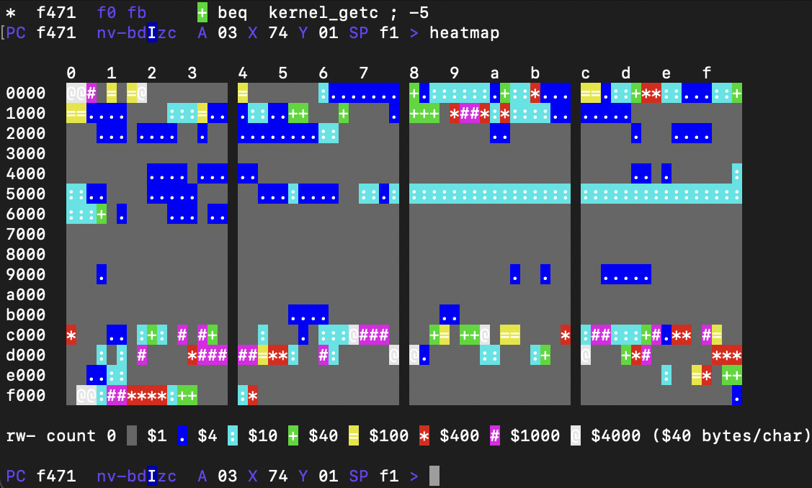

`c65` provides a simple 65c02 simulator based on
[`fake65c02.h`](https://github.com/C-Chads/MyLittle6502)
that mimics [`pymon`](https://github.com/mnaberez/py65)'s
default magic getc and putc interface.
`c65` also provides a magic [blockio](#blockio) interface
which supports simulator IO to/from an external binary file,
as well as a simple [profiling debugger](#debugger).

## Usage

The simplest usage is:

    c65 -r taliforth-py65mon.bin

This loads the TaliForth2 memory image at the top of memory
and resets to the address stored at $fffc. This corresponds exactly to
`py65mon -m 65c02 -r taliforth-py65mon.bin` without the monitor tools.
Various options control the simulator (use `c65 -?` for current options):

    -a <address>    # load the rom file at a specific address
    -r <address>    # run from address, rather than via the reset vector @ $fffc
    -m <address>    # change the magic IO base address (default $f000)
    -b <file>       # enable blockio using the provided binary file
    -g              # start c65 in the debugger

## Magic IO

`c65` provides a magic IO block that spans a 22 byte range
and is normally based at $f000. Use `-m` to change the base address.
This supports a number of IO functions:

    Addr    Name    Description

    $f001   putc    Write here to send the byte to stdout
    $f003   kbit    Return non-zero if key ready to fetch with getc
    $f004   getc    Non-blocking read from stdin, returns 0 if no byte ready

    $f006   start   Reading here starts the cycle counter
    $f007   stop    Reading here stops the cycle counter
    $f008-b cycles  Current 32 bit cycle count in NUXI order

    $f010   blkio   Write here to execute a block IO action (see below)
    $f011   status  Read block IO status here
    $f012-3 blknum  Block number to read/write
    $f014-5 buffer  Start of 1024 byte memory buffer to read/write

## Block IO

The base address (default $f010) is the first byte of a six byte interface:

    offset  name    I/O description
    0       action  I   initiate IO action (set other params first)
    1       status  O   returns 0 on success and 0xff otherwise
    2-3     blknum  I   0-indexed low-endian block to read or write
    4-5     bufptr  I   low-endian pointer to 1024 byte buffer to r/w

To initiate a block IO operation, set the `blknum` and `bufptr` parameters
and then write the `action` code to the base address. The `status`
value is returned. Four actions are currently supported:

- status (0): query blkio status: sets `status` to 0x0 if enabled, 0xff otherwise
- read (1): read the 1024 byte block @ `blknum` to `bufptr`
- write (2): write 1024 bytes from `bufptr` to the block @ `blknum`

Note that an external blockfile must be specified with the `-b ...` option
to enable block IO. The file is simply a binary file with block k
mapped to offset k*1024 through (k+1)*1024-1.
The two-byte `blknum` supports a maximum addressable file size of 64Mb.
A portable (cross-platform) check for blkio availability is:
1. write 1 to `status`
2. write 0 to `action`
3. test if `status` is now 0

You can boot from a blkio file by adding the following snippet to
the end of `forth_code/user_words.fs`:

    \ if blkio is available and block 0 starts with the bytes 'TF'
    \ `evaluate` the remainder of block 0 as a zero-terminated string
    \ Tequires the word asciiz> ( addr -- addr n )

    : blkrw ( blk buf action -- )
        -rot $c014 ! $c012 ! $c010 c!
    ;
    :noname
        1 $c011 c! 0 $c010 c! $c011 c@ 0= if  \ blkio available?
            0 $1000 1 blkrw
            $1000 @ $4654 = if                \ starts with magic "TF" ?
                $1002 asciiz> evaluate else   \ run the block
                ." bad boot block" CR
            then else
            ." no block device" CR
        then
    ; execute

## Debugger

`c65` offers a simple profiling debugger which is useful to explore and extend Taliforth
or other 65x02 code.
Enable it with the `-g` option.
You can import symbolic labels in VICE format like those generated by the `Makefile`
using the `64tass` option `--vice-labels`.
For example you can debug the default Taliforth build like:

    c65/c65 -g -r taliforth-py65mon.bin -l docs/py65mon-labelmap.txt

and should see something like this:

    c65: reading ../taliforth-py65mon.bin to $8000:$ffff
    c65: PC=f016 A=00 X=00 Y=00 S=fd FLAGS=<N0 V0 B0 D0 I1 Z0 C0> ticks=0
    Imported 1581 labelsfrom docs/py65mon-labelmap.txt.  Skipped 389 lines (locals or malformed).
    Type ? for help, ctrl-C to interrupt, quit to exit.
    kernel_init:
    io_end:
    *  f016  78          sei
    PC f016  nv-bdIzc  A 00 X 00 Y 00 SP fd >

Your actual prompt should be a little more colorful.
In particular note that CPU flags are highlighed and capitalized when set.
Try typing `d<tab><enter>` to disassemble from the current program counter.
(Actually `d<enter>` is enough, but sometimes tab completion is handy.)

    PC f016  NV-BDIZC  A 00 X 00 Y 00 SP fd > disassemble
    kernel_init:
    io_end:
    *  f016  78        sei
       f017  a2 00     ldx  #$0
       f019  bd 32 f0  lda  s_kernel_id,x
       f01c  f0 06     beq  $f024 ; +6
       f01e  20 2d f0  jsr  kernel_putc
       f021  e8        inx
       f022  80 f5     bra  $f019 ; -11
       f024  4c 00 80  jmp  xt_cold
    PC f016  NV-BDIZC  A 00 X 00 Y 00 SP fd >

You can continue disassembly with just `<enter>`, repeating the previous command
from the current address.  Command history is available with the up/down arrows,
along with many [Gnu readline](https://en.wikipedia.org/wiki/GNU_Readline)-style key bindings.
For example try `ctrl-R` to search previous commands.
History persists across sessions in the `.c65` file.

You can disassemble a specific
range with `d f000.f024`
(use `.` to separate address expressions, wozmon style)
or `d xt_cold..20` (the extra `.` indicates an offset of $20 bytes from the start address).
To check what the init routine will print, try `mem s_kernel_id`.
This shows 256 bytes by default but the same `..offset` or `.end`
trick works for custom ranges.

    PC f016  NV-BDIZC  A 00 X 00 Y 00 SP fd > mem s_kernel_id
    f030        54 61 6c 69 20 46  6f 72 74 68 20 32 20 64  |  Tali Forth 2 d|
    f040  65 66 61 75 6c 74 20 6b  65 72 6e 65 6c 20 66 6f  |efault kernel fo|
    f050  72 20 70 79 36 35 6d 6f  6e 20 28 30 34 2e 20 44  |r py65mon (04. D|
    f060  65 63 20 32 30 32 32 29  0a 00 00 00 00 00 00 00  |ec 2022)........|
    ...

You can set breakpoints on read, write or execute.
Type `break xt_cold` to stop executing
once the startup message is printed.  We can check that
ROM (above $8000) is never written with `break 8000..ffff write`
but might follow up with `del f000..16` to ignore writes to the magic IO block.
Let's also add a read breakpoint within the startup message: `break f040 read`.
This should should stop after reading the *e* in *default*.
Execution breakpoints display as `B` in disasembly listings,
and read/write breakpoints are highlighted in `memory` dumps.
With the above breakpoints, use `continue` to execute from the current PC:

    PC f030  NV-BDIZC  A 54 X 00 Y 00 SP fb > c
    Tali Forth 2 df040: memory read
        0  1  2  3  4  5  6  7   8  9  a  b  c  d  e  f   0123456789abcdef
    f040  65 66 61 75 6c 74 20 6b  65 72 6e 65 6c 20 66     |efault kernel f |
    *  f01c  f0 06       beq  $f024 ; +6

Note the expected memory break after printing *d* and reading *e*.
Continue again to land at `xt_cold`:

    PC f01c  nv-bdIzc  A 65 X 0e Y 00 SP fd > c
    efault kernel for py65mon (04. Dec 2022)
    xt_cold:
    code0:
    forth:
    *B 8000  d8          cld

You can `step` instruction by instruction, or use `next` to treat
`jsr ... rts` as one step.  You can `call` a subroutine and return
to the current PC on completion, or just `run` from an arbitrary address or label.
You can even test interrupts using `trigger irq`, `nmi` or `reset`.  This will set up
the simulator state as if the corresponding interrupt had occurred,
ready for for you to `step` or `continue` into your handler.

When the simulation is running without a breakpoint, use `ctrl-C` to return to the prompt.
Try `continue` again to enter the interactive Taliform REPL.  Put some numbers on the stack
and use `ctrl-C` to get back to the debugger.

    Tali Forth 2 for the 65c02
    Version 1.1 06. Apr 2024
    Copyright 2014-2024 Scot W. Stevenson, Sam Colwell, Patrick Surry
    Tali Forth 2 comes with absolutely NO WARRANTY
    Type 'bye' to exit
    1 2 3 4 .s <4> 1 2 3 4  ok
    <ctrl-C>

Since Tali uses X as its stack pointer,
`mem x.80` will show our content:

    *  f02a  f0 fb       beq  kernel_getc ; -5
    PC f02a  nv-bdIzc  A 03 X 6e Y 00 SP f9 > m x.80
           0  1  2  3  4  5  6  7   8  9  a  b  c  d  e  f   0123456789abcdef
    0060                                             00 02  |              ..|
    0070  04 00 03 00 02 00 01 00  00 00 00 00 00 00 00 00  |................|

The extra `$2000` is presumably part of the REPL state,
and the empty space beyond $78 is Tali's "flood plain".  Setting `break 78:80 any`
would be a good indicator of stack underflow.

Note how we used `x` as the start of the range.  In fact you can use C-style expressions
wherever an address or value is called for.  Mix and match symbols (case-sensitive),
CPU registers and flags (case insensitive) and constant values.  A few extra unary
operators let you dereference a memory address as a word (`@`) or byte (`*`),
or extract the most (`>`) or least (`<`) significant byte of a value like most assemblers.
Use the `~` command as a handy calculator to evaluate one or more expressions,
displaying the results in multiple bases.  For example:

    PC f02a  nv-bdIzc  A 03 X 6e Y 00 SP f9 > ~ *(s_kernel_id + y)
    *(s_kernel_id + y)      :=  $54  #84  %1010100  'T

Combined with `set`, expressions make it easy to mimic opcodes or
do more complex manipulations like `set a <(@(jmp_table + x) + y)`.
You can also modify flag values like `set z #42 & my_flag`.
If you want to change memory, use `fill` to set a range of addresses
to a sequence of values.

`c65` also supports simple profiling by counting read, write and execute
access to each memory location.  After executing the Tali REPL,
we can use `heatmap` to get a sense for what happened:

    PC f02a  nv-bdIzc  A 03 X 6e Y 00 SP f9 > heatmap

          0   1   2   3    4   5   6   7    8   9   a   b    c   d   e   f
    0000  @&     &+   +                        :
    1000
    2000
    3000
    4000
    5000
    6000
    7000                                                     . . . . . . . .
    8000  +..::. :.  ::    :    .  :::*     : ..: ::          ::::++**+ :..+
    9000       : : : ...:+   .* ***          .:.      ..++::  :.....::
    a000
    b000               ...                           +++++++ +:::::::::::::::
    c000  :::::::::::::::: ::::+:::........ ......
    d000             ..              &&+:*: .
    e000
    f000  %.                                                                .

    rw- count 0   1 . 4 : 10 + 40 * 100 % 400 & 1000 @ 4000 (40 bytes/char)

The ascii art is better in color, but we can still see hotspots in the first
half of zero page as well as the top of page one (the data and return stack).
Note the scale doubles in each bucket, so the top few colors capture almost all
the activity.
This overview summarizes 64 ($40) bytes in each character but we can zoom in
to see more detail in smaller ranges.
For example `heatmap 9400..400 x` shows which individual
addresses have been executed as opcodes.  Use `inspect 9400..400` to
find labels, breakpoints and the top hotspots within that range.  You'll also notice
that `disassemble` will now include profiling from the last heatmap which
can be helpful to find dead code, critical sections and potential branch optimizations.

That's enough for now, but if you're keen just use `?` to show more commands and options.
When you're done `quit` will exit the debugger.  Have fun!

## Developers

`c65` should build on posix-like platforms such as OS X; windows native using [MinGW](https://en.wikipedia.org/wiki/MinGW); and on the Windows [WSL](https://learn.microsoft.com/en-us/windows/wsl/setup/environment).
The debugger uses line editing capabilities from a branch of [linenoise](https://github.com/msteveb/linenoise.git)
which supports both Windows and simple ANSI escapes for the prompt, with one modification to allow
SIGINT (ctrl-C) to interrupt the simulator rather than act as a line editing command.
[`fake65c02.h`](https://github.com/C-Chads/MyLittle6502) has been modified slightly to support extended W65C02
NOP instructions as well as disassembly.
(Early on I tried a simulator based on https://github.com/omarandlorraine/fake6502
but it seems to have some subtle bug. It runs most of TaliForth in 65c02 mode but `: foo 3 2 + ;`
fails with a stack underflow.)
